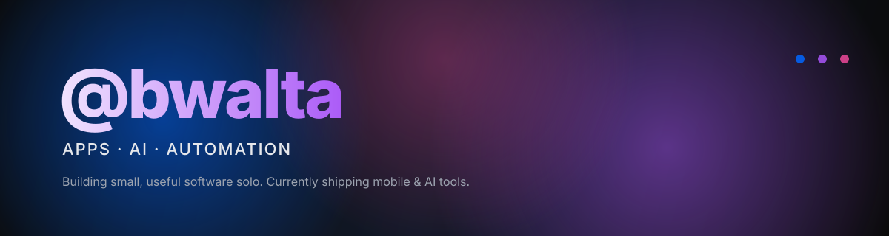

### Ben Walta · Solo Builder · Founder of Aeopilot

 

<picture>
  <source media="(prefers-color-scheme: dark)" srcset="https://readme-typing-svg.demolab.com?font=Inter&size=22&duration=3000&pause=900&color=FFFFFF&center=true&vCenter=true&width=600&lines=Founder+of+Aeopilot+%F0%9F%9A%80;Currently+shipping+Companionry+%F0%9F%93%B1;Solo+builder+%C2%B7+Apps+%C2%B7+AI+%C2%B7+Automation;Building+small%2C+useful+software">
  
</picture>

 

## Was ich baue

Mobile Apps, kleine Web-Tools und ein bisschen Automatisierung dazwischen.
Solo gebaut — von der ersten Skizze bis zum Release.

> **Mehr im Detail:** [bwalta.github.io](https://bwalta.github.io) — meine Präsentationsseite.

 

## Featured

<table>
<tr>
<td width="33%" valign="top">

### 📱 Companionry
Eine Lern-App für Schüler mit kleinen KI-Begleitern.
  
[**Mehr ansehen →**](https://bwalta.github.io/#work)

</td>
<td width="33%" valign="top">

### 🤖 Aeopilot
Prüft, wie gut Websites von KI-Suchen wie ChatGPT, Claude und Gemini gefunden werden.
  
`Next.js` · `TypeScript` · `OpenAI`
  
[**Mehr ansehen →**](https://bwalta.github.io/#work)

</td>
<td width="33%" valign="top">

### 💬 WhatsApp Agent
Ein WhatsApp-Bot, der natürlich antwortet.
  
`Node.js` · `OpenAI` · `Twilio`
  
[**Mehr ansehen →**](https://bwalta.github.io/#work)

</td>
</tr>
</table>

 

## Stack

 

[**bwalta.github.io →**](https://bwalta.github.io)

© @bwalta

